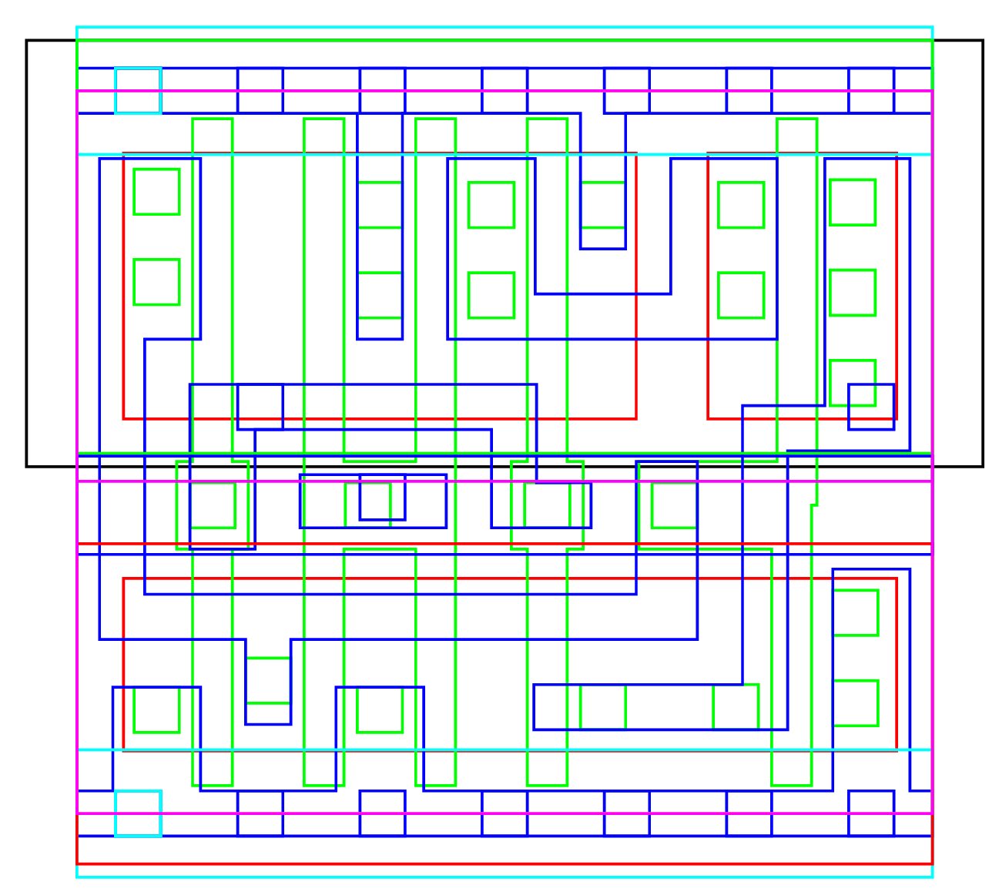

GDS2VEC
=======

Convert GDS to vector format for visualization and easy conversion to other
formats.

### Build

Get libgdsii library
```
sudo apt-get install libgdsii-dev
```

then

```
make
```

### Use

```
Usage: ./gds2vec [options] command <gdsfile>
[Command]
        ps      : output postscript
        layers  : show available layers
        desc    : print description of content
[Options]
        -h         : help
        -l <layer> : choose a specific layer
        -o <file>  : output filename (otherwise: stdout)
        -s <scale> : output scale (default: 20000)
```

Skywater 130 XOR gate

