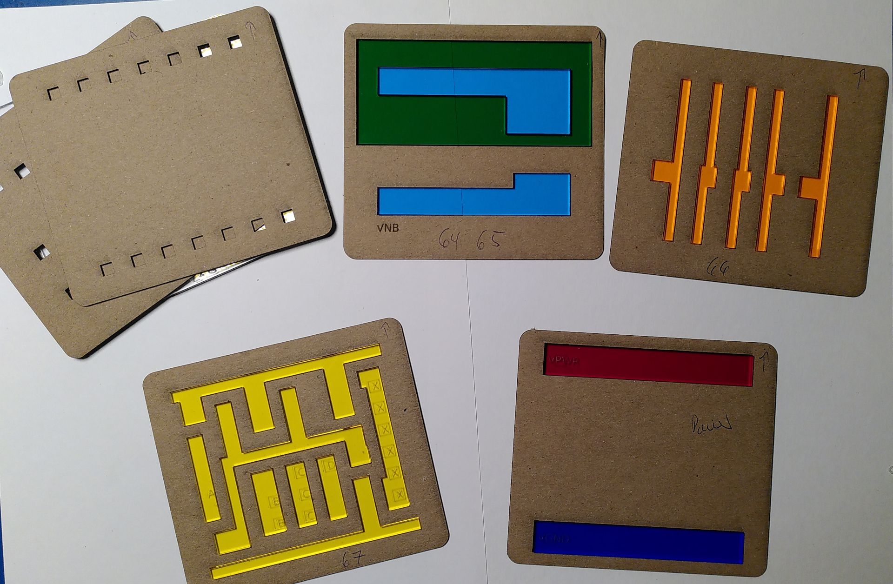
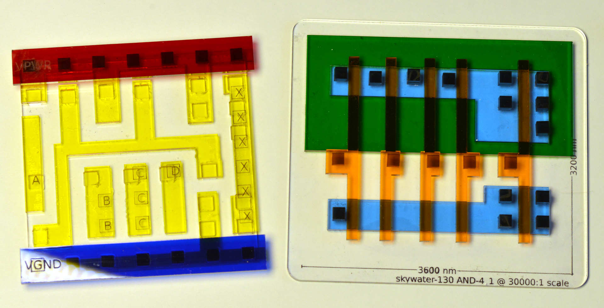
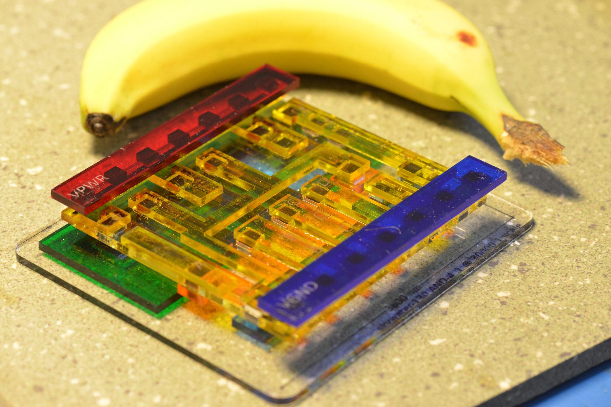
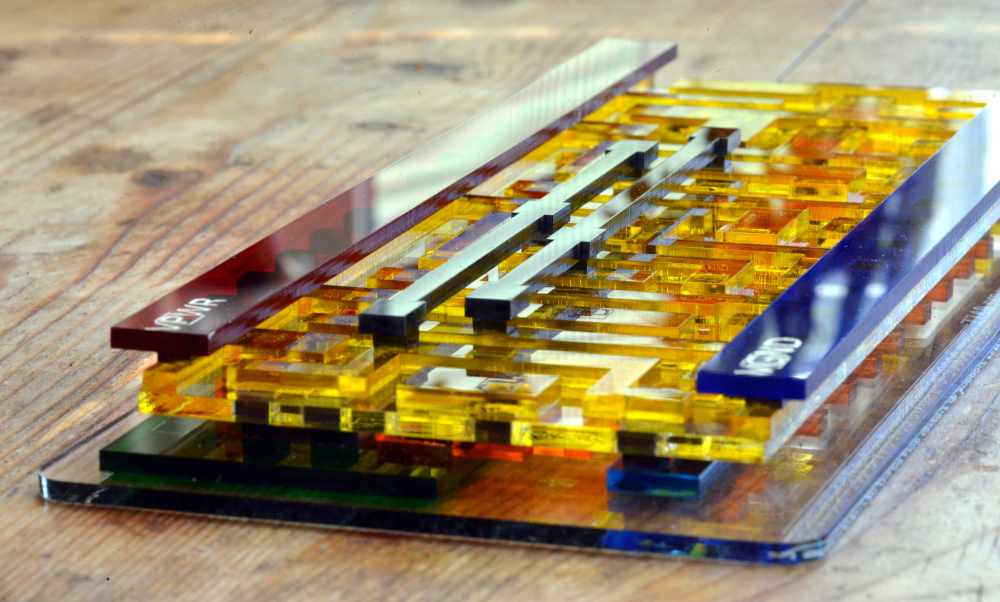
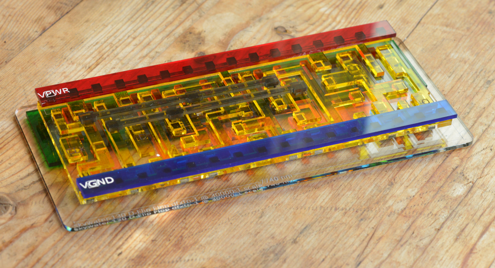
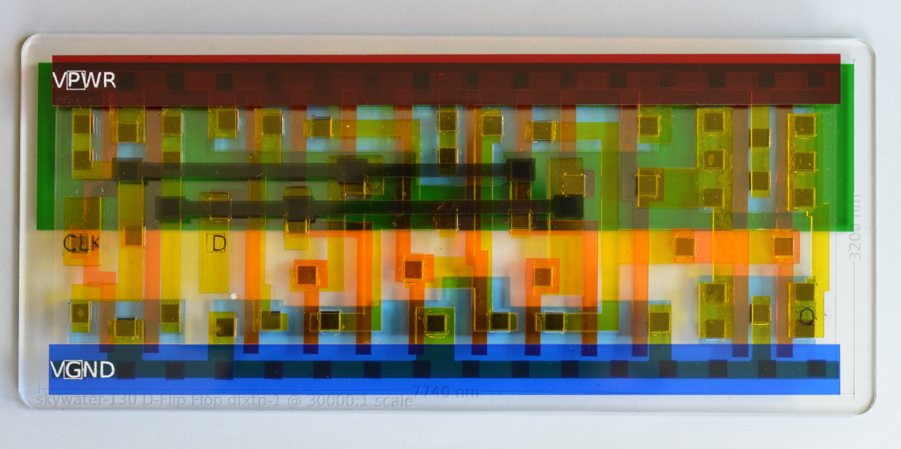

GDS2VEC
=======

Convert GDS to vector format for visualization and easy conversion to other
formats.

### Build

Get libgdsii library
```
sudo apt-get install libgdsii-dev
```

then

```
make
```

### Use

```
Usage: ./gds2vec [options] command <gdsfile>
[Command]
        sky130  : output laser-cut files for sky130 standard cells
        ps      : output postscript of chosen layers
        layers  : show available layers
        desc    : print description of content
[Options]
        -h         : help
        -l <layer[,layer...]> : choose layers (allowed multiple times)
        -o <file>  : output filename (otherwise: stdout)
        -s <scale> : output scale (default: 30000)
        -t <title> : Title on base-plate
```

The `sky130` command outputs laser cut geometry for all cardboard templates
and acrylic cuts needed:

```
./gds2vec sky130 -t "AND Gate" /tmp/sky130_fd_sc_hd__and4_1.gds > /tmp/layers.ps
```

If you need DXF for your laser cutter, use the makefile-rule to create it:

```
make /tmp/layers-1.dxf
```

The last page creates a bunch of pins for the vias. These are cut in two
separate DXF layers (horizontal first, followed by vertical) so that parts
don't fall through before they are fully cut. Make sure to tell your laser
software to cut them in that sequence.

It is useful to create some cardboard templates for alignment while putting
things together.

Templates help alignment      | Separable
------------------------------|--------------------
 | 


With 4.7μm Banana               | See through
--------------------------------|--------------------
 | 

D-FlipFlop dfxtp-1               | Overview                        | See through view
---------------------------------|---------------------------------|--------------------------
 |  | 
