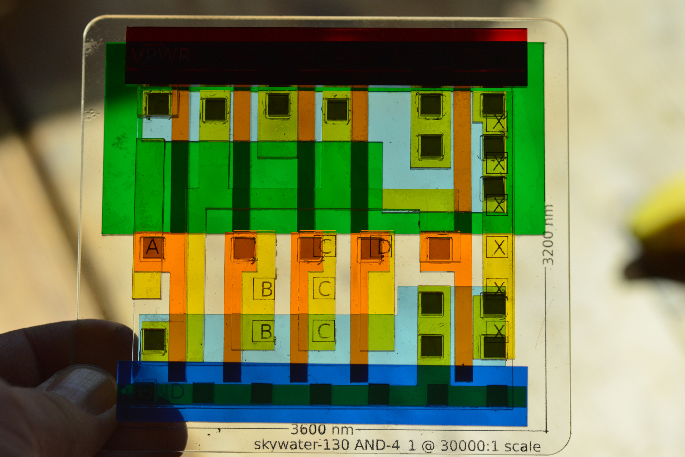

GDS2VEC
=======

Convert GDS to vector format for visualization and easy conversion to other
formats.

## Build

Get libgdsii library
```
sudo apt-get install libgdsii-dev
```

then

```
make
```

## Use

```
Usage: ./gds2vec [options] command <gdsfile>
[Command]
        sky130  : output laser-cut files for sky130 standard cells
        ps      : output postscript of chosen layers
        layers  : show available layers
        desc    : print description of content
[Options]
        -h         : help
        -l <layer[,layer...]> : choose layers (allowed multiple times)
        -o <file>  : output filename (otherwise: stdout)
        -s <scale> : output scale (default: 30000)
        -t <title> : Title on base-plate
```

## Fabrication output

The `sky130` command outputs laser cut geometry for all cardboard templates
and acrylic cuts needed:

```
./gds2vec sky130 -t "AND Gate" /tmp/sky130_fd_sc_hd__and4_1.gds > /tmp/layers.ps
```

If you need DXF for your laser cutter, use the makefile-rule to create it:

```
make /tmp/layers-1.dxf
```

### Cut annotation

Colors (Layers) in the PostScript/DXF output have different meaning

  * Black (RGB: 0, 0, 0): cut line. Just center cut, no kerf consideration.
  * Green (RGB: 0, 1, 0): scan engrave on surface e.g. for text
  * Cyan (RGB: 0, 1, 1):  line engrave on surface
  * grey (RGB: 0.8, 0.0, 0.8): comments, fabrication info on bottom.

### Materials

For this run below, the following materials and colors were used. For
acrylic, ~3mm thickness.

#### Cardboard
  * Cardboard or chipboard: templates to help align the acrylic pieces, and
    also not 'sticky' if hit with acrylic cement. Should be sturdy and with a
	thickness <= acrylic thickness.

#### Acrylic
  * Transparent: for back-plane and carrier for the local
    interconnect support (which is yellow)
  * Lightblue: diffusion layer
  * Darkgreen: nwell
  * Orange: polysilicon
  * Yellow: local interconnect
  * Red: for VPWR on Metal1 layer
  * Dark Blue: for VGND on Metal1 layer
  * Smoke grey: for other things on Metal1 layer
  * Smoke grey: for via 'pins'. Makes sense to also cut in double thickness
    material as some of them need to be double thickness.

### Fabrication remarks
The last page creates a bunch of pins (about 4x4mm) for the vias. These are cut in two separate DXF layers (horizontal first, followed by vertical) so that
parts don't fall through before they are fully cut.
Make sure to tell your laser software to cut them in that sequence (typically
by switching _off_ cut optimizations).

Some of these pins need to be double the height as they span two layers on
glue-up. This can be done by stacking two of them where needed, but it is also
a good idea to cut these pins as well with double thick material.

It is useful to create some cardboard templates for alignment while putting
things together.

Templates help alignment      | Separable
------------------------------|--------------------
 | 


4.7μm Banana for scale          | See through view
--------------------------------|--------------------
 | 

D-FlipFlop dfxtp-1               | Overview                        | See through view
---------------------------------|---------------------------------|--------------------------
 |  | 
